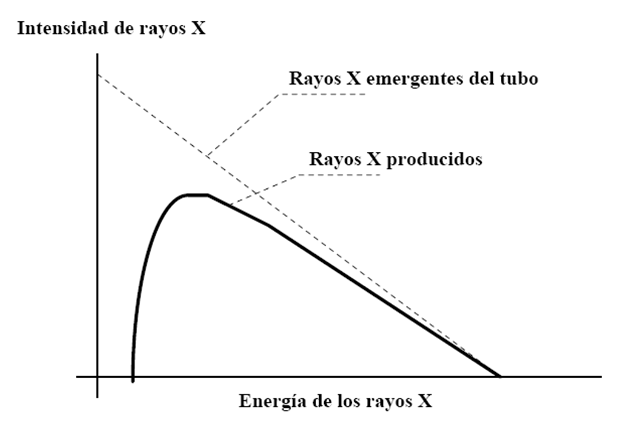
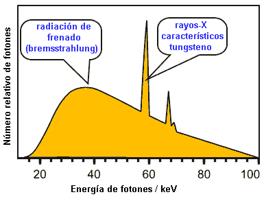

###################
Espectro de rayos X
###################

Al incidir electrones en el blanco (generalmente de W), los rayos X producidos no son monoenergéticos, sino que presentan un espectro en un rango de energías que va de 0 a un máximo igual a la tensión con la que son acelerados los electrones, en unidades de eV.

La intensidad del haz de fotones producidos por radiación de frenado en función de la energía E, en ausencia de filtros, disminuye linealmente con E, como se muestra en la **Figura 9**.

    **Figure 9:** I vs. E.

Los electrones que se desprenden del ánodo, a energías cercanas al MeV, generan rayos X característicos que pueden presentar líneas correspondientes al W u otros materiales del ánodo. La Figura 10 muestra un espectro de rayos X típico contemplando la radiación de frenado (Bremsstrahlung) y los rayos X característicos debido al blanco de tungsteno (W).

    **Figure 10:** Espectro típico.
