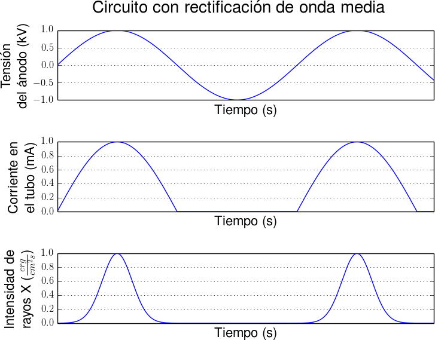
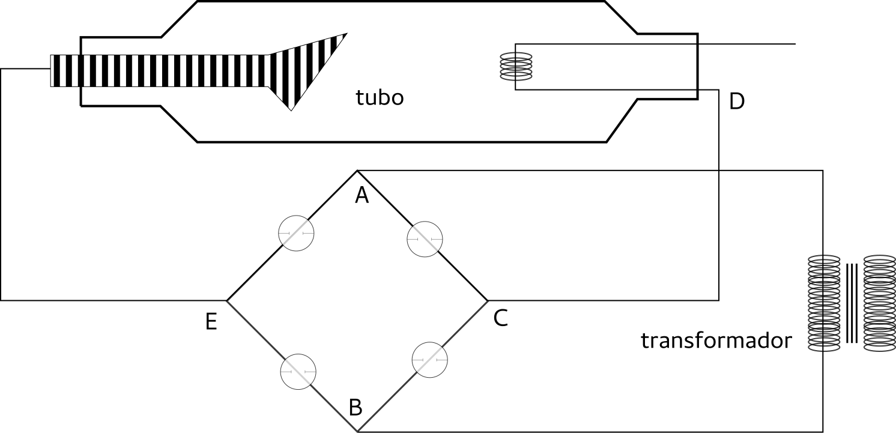
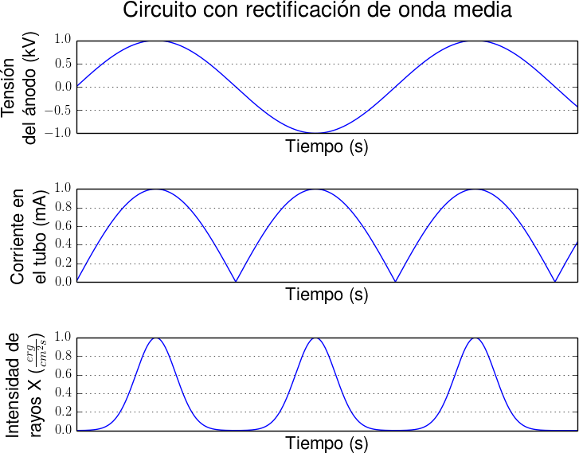

#################################
Circuitos para equipos de rayos x
#################################

Circuito con rectificación de onda media
========================================

Un transformador permite regular la tensión entre el ánodo y el cátodo, como se muestra en la Figura 5.

    **Figura 5:** Tubo con transformador.

Al ser la tensión alterna, las polaridades de ánodo y cátodo cambian cíclicamente. Así, solo cuando el ánodo es positivo existe corriente, ya que cuando el ánodo es positivo, éste no atraerá electrones. Esto generará solo haz de rayos x durante los intervalos en los que exista corriente. En la Figura 6 se puede observar cualitativamente esto, primero el comportamiento de la tensión en el ánodo, segundo la corriente generada por este comportamiento, en el tubo. Y finalmente, la itensidad del haz de rayos x generado que dependerá de la corriente pero también será moderada por la tensión, provocando un pico más pronunciado que el de la corriente.

Este circuito se conoce como de rectificación de media onda y suele incorporar una válvula rectificadora para evitar la emisión de electrones del ánodo al cátodo cuando la polaridad lo permitiría.

    **Figura 6:** Intensidad debida a circuito de media onda (normalizada al máximo).

Circuito con rectificación de onda completa
===========================================

Al variar la corriente como se vio en el caso anterior, es necesario configurar un sistema tal que permita obtener siempre una polarización positiva del ánodo de forma tal de obtener contínuamente corriente y así, contínuamente un haz de rayos x.

Para esto se utilizan circuitos como el de Graetz que se muestra en la Figura 7, donde:

* Cuando A es negativo: los electrones recorren el camino ACDEB.
* item Cuando A es positivo: los electrones recorren el camino BCDEA.

    **Figure 7:** Circuito de rectificación de onda completa.

Así, se obtiene corriente contínua y su consiguiente contínua intensidad del haz de rayos x, como se muestra en la Figura Figura 8.

    **Figura 8:** Intensidad debida a circuito de onda completa (normalizada al máximo).
