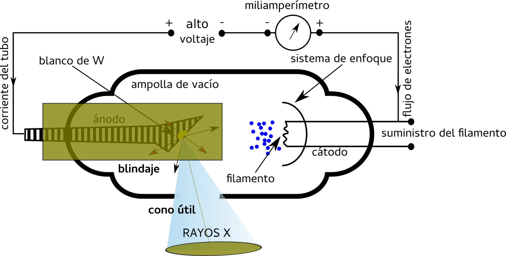

#################
Tubos de rayos X
#################

Se conoce como 'tubo de rayos X' al lugar físico donde se genera esta radiación electromagnética, mediante un proceso en el cual los electrones acelerados son frenados al colisionar contra un material blanco.

Un tubo de rayos X convencional, como el que se muestra en la **Figura 1a**, está compuesto básicamente por un ánodo y un cátodo alojados en una cavidad donde se ha practicado vacío. Esta cavidad suele ser una ampolla de vidrio y el proceso de producción de rayos X se da al emerger electrónes del cátodo e impactar en el ánodo.

.. figure:: img/foto_tubo.png
    :align: center

    **Figura 1a:** Tubo de rayos X clásico.

Un tubo de rayos X puede ser dibujado esquemáticamente como se muestra en la **Figura 1b**,

.. figure:: img/tubo_cW.png
    :align: center

    **Figura 1b:** Esquema de un tubo de rayos X clásico de Tungsteno.

Como se puede observar, las partes principales de un tubo de rayos X incluyen:

* Ánodo
* Cátodo
* Generador de diferencia de potencial
* Generador de corriente
* Ampolla con vacío

El **ánodo**, también conocido como blanco o anticátodo, se encuentra generalmente formado por una pieza de cobre (Cu) con un blanco de tungsteno (W) o molibdeno (Mo). Veremos, más adelante, que los materiales de cada parte son elegidos en función de sus propiedades físicas. El blanco de W o Mo debe ser altamente refractario [1]_ pues deberá conservar sus propiedades a altas temperaturas, mientras que debe estar adherido a un material como el Cu que funcione de disipador del calor al que es sometido.

El **cátodo**, compuesto por un filamento metálico, es calentado por una corriente eléctrica, lo que imparte calor a sus átomos y genera una 'nube' de electrones libres en su superficie. Para generar esta nube, es necesario que el filamento alcance temperaturas muy elevadas, por lo que, aprovechando su alta temperatura de fusión, el filamento suele también ser de W, y la cantidad de electrones en la nube dependerá de la corriente en el filamento.

Al aplicarse una diferencia de potencial ∆V (o simplemente V) entre el ánodo y el cátodo dejando al ánodo como positivo (+), los electrones (de carga negativa) que han sido desprendidos del cátodo por el calentamiento (y se encuentran libres) se dirigirán al ánodo acelerándose por el campo eléctrico. Así, alcanzarán su velocidad máxima al llegar al ánodo. La energía cinética (asociada a la velocidad) de los electrones alcanzará un máximo dependiente del voltaje aplicado. Al tratarse de electrones, se puede expresar esta energía en electronvoltios (eV) y la máxima energía alcanzada corresponderá numéricamente a la diferencia de potencial V. Así, para una diferencia de potencial de 100 kV, tendremos electrones con una energía máxima de 100 keV.

Al impactar (y frenar bruscamente) contra el blanco de W, y perder toda su energía cinética, los electrones producen rayos X, principalmente por dos procesos físicos:

* **Bremsstrahlung** [2]_: por frenado por interacción coulombiana del electrón incidente y el campo nuclear de los átomos del ánodo, y
* **Rayos X característicos** [3]_: el electrón incidente interactúa con un átomo blanco, eyecta un electrón de una de las capas y genera una vacancia que es ocupada por un electrón de energía superior; el que libera un fotón con energía cinética correspondiente a la diferencia de energía entre las capas.

Por la forma en la que son generados, los fotones característicos corresponderán a determinadas energías asociadas al material del ánodo, determinando un espectro discreto. Por otro lado, los fotones provenientes de la radiación de frenado conformarán un contínuo de energía entre 0 y la energía máxima de los electrones, ya que estos últimos se deben a la desaceleración (proceso contínuo) de los electrones.

A los fines prácticos de este curso, nos interesará particularmente la radiación de frenado, ya que los rayos X característicos serán eliminados por utilización de filtros en la mayoría de los procedimientos, sobre todo en radiodiagnóstico.

El rendimiento de producción (cantidad de fotones generados por energía entregada) de Bremsstrahlung en este procedimiento clásico en los tubos convencionales es bajo, ya que la mayor parte de la energía cinética de los electrones se transforma en calor al colisionar con el blanco. Así, en primera aproximación, el rendimiento es de:

.. math::
      10^{-6} \, T\cdot Z

donde T representa la energía cinética de los electrones en unidades de keV (es decir la diferencia de potencial V expresada en kV) y Z es el número atómico del material blanco. Si, por ejemplo, se trata de un blanco de W (Z = 74) y se aplica una diferencia de potencial de 100 kV, el rendimiento será de :math:`10^{−6} \cdot 100 \cdot 74 = 7,4 · 10^{−3} ≈ 0,01`. En este caso típico entonces, el rendimiento se encuentra en el orden del 1 %, dejando que el otro 99 % se disipe en forma de calor sobre el ánodo. Por esto también es que se necesita un blanco compuesto por un material de alto punto de fusión [4]_ y con gran capacidad para eliminar el calor. Así es que se utiliza W o Mo en el extremo de una pieza de cobre refrigerada por circulación de aceite, agua o aire. Como se ve, también, la elección de un material de alto Z favorece la producción de rayos X.

En los equipos de rayos X, el calentamiento del cátodo se produce por la circulación de la corriente eléctrica en el filamento, donde se verifica que una pequeña variación en la temperatura del filamento provoca una gran variación en el número de electrones que atravesarán el tubo. La diferencia de potencial en cambio, determinará la energía cinética máxima (y la velocidad) de los electrones, pero no influirá significativamente en el número de electrones que alcanzará el ánodo.

Tubos de rayos X para diagnóstico
=================================

El objetivo de estos tubos es obtener rayos X capaces de atravesar material biológico en dimensiones del orden del cuerpo humano que se desea analizar. Para esto no solo es necesario obtener un haz de rayos X con la energía suficiente como para atravezar algunas decenas de centímetros de material biológico, sino también uno lo suficientemente homogéneo y de una superficie pequeña de forma tal de evitar problemas de penumbra [5]_.

Finalmente, también (y principalmente) hay que lograr un haz con suficiente intensidad como para lograr una imagen nítida con un tiempo mínimo de exposición. Esto último, no solo porque la exposición a la radiación es nociva para la salud, sino también por los movimientos propios del cuerpo humano (respiración, latido del corazón, etc) que pueden generar distorsiones en la imagen.

Uno de los problemas típicos que se desea evitar y/o minimizar a la hora de la obtención de imágenes por rayos X, es el efecto de penumbra que puede dañar severamente la nitidez de la imagen obtenida por el sistema de detección. Se requieren entonces, para satisfacer esta necesidad, tres condiciones:

* *que los rayos X provengan de una fuente “pequeña”*: para evitar efectos de penumbra,
* *que la distancia fuente-objeto sea “grande”*: para lograr un haz homogéneo, y
* *que la distancia objeto-detector sea “pequeña”*: para evitar dispersión de los rayos X por agentes externos (aire, por ejemplo).

En cada uno de los casos, 'pequeña' o 'grande' se refieren a tamaños relacionados con la geometría general. La **Figura 2** muestra cualitativamente la formación de la penumbra.

.. figure:: img/penumbra.png
    :align: center

    **Figura 2:** Efecto de penumbra.

Como se puede observar, la penumbra constituye un efecto geométrico que puede dificultar severamente la interpretación de la imagen.

Ánodo
*****

Se busca así, construir un ánodo capaz de:

* brindar una fuente pequeña
* proveer suficiente intensidad como para obtener una imagen nítida
* lidiar con el problema del calentamiento debido a los electrones provenientes del cátodo

El área de impacto de los electrones determinará la cantidad de fotones generados, mientras que el tamaño de esta área no es otra cosa que el tamaño de la fuente de fotones. Para obtener un área 'grande' que brinde una fuente 'pequeña' es que se ha implementado la estrategia de girar la zona de impacto.

Por esto, se dispone de un ánodo inclinado donde impactan los electrones, como se puede observar en lado izquierdo de la **Figura 3**. Aquí se define un ángulo α que hace que electrones que impactan sobre una longitud :math:`a` se vean como si proveniesen de una fuente de longitud :math:`b`, desde el objeto/detector.

.. figure:: img/angulo_anodo.png
    :align: center

    **Figure 3:** Configuración del ánodo.

Así, por ejemplo, si contamos con un ángulo α = 17° y disponemos un ánodo donde :math:`a` = 7 mm, entonces :math:`b` será ≈ 2 mm. Si el ancho del ánodo entonces es de 2 mm, obtendremos una fuente real de 14 mm pero que será 'vista' por el detector como si fuese de 4 mm.

Por otro lado, ante el problema del calentamiento del ánodo, se suele implementar un diseño conocido como '*ánodo rotante*', de forma tal que pueda girar, logrando que los electrones impacten siempre sobre una superficie diferente, disipando mejor el calor. El ánodo suele girar entre 10 y 12 mil rpm y se construye como se muestra en el lado derecho de la **Figura 3**. Además, en estos tubos α suele variar entre 16°y 17,5°.

Tubos de rayos X para radioterapia
==================================

Para el caso de radioterpia no es tan importante la intensidad como la energía entregada. En estos casos se vuelve crítico el control de la temperatura del ánodo, al necesitarse irradiaciones por tiempos prolongados. Para esto se sumerge el tubo en aceite y, para eliminar el calor transmitido a este, se agrega un serpentín de agua fría circulando.

Al no ser tan importante la disminución del efecto de penumbra, el área de impacto de los electrones en el ánodo (fuente) puede ser mayor que en el caso de los tubos dedicados a imágenes de diagnóstico.

Al ser utilizados electrones más energéticos para los tratamientos de radioterapia, a partir de los 200 keV el ánodo puede generar electrones eyectados por la misma interacción del blanco con aquellos que fueron acelerados desde el cátodo (los electrones producto de ionizaciones en los átomos pueden escapar del material blanco). Estos electrones eyectados interactuarán entonces con otras partes del tubo y generarán también rayos X que modificarán el haz principal, generando otras componentes de Bremsstrahlung y rayos X característicos distintoas a las del ánodo.

Para evitar este último problema se suele cubrir la zona del ánodo primero con Cu y finalmente con W, como muestra la **Figura 4**. Así, al colisionar los nuevos electrones con el Cu (Z = 29) serán detenidos produciendo pocos rayos X, y éstos serán absorbidos por el W sin generar más radiación. Además se suele agregar una ventana de Be a la salida del haz, que amortigua el haz de rayos X (sobre todo sus componentes menos energéticas) y absorbe los electrones que hayan pasado el blindaje.

    **Figura 4:** Tubo de rayos X para radioterapia.

En estos tubos, el ángulo α varía entre los 26°y los 32°, aumentando el cono útil.

.. [1] Gran resistencia a sufrir alteraciones de sus propiedades físicas por cambios de temperatura.
.. [2] Radiación de frenado, del alemán bremsen (frenar) y Strahlung (radiación).
.. [3] Se llaman característicos porque, al depender de la diferencia de energía entre las capas del átomo, responde a las características específicas del elemento.
.. [4] La temperatura de fusión del W es de 3380ºC
.. [5] El efecto de penumbra es un efecto determinado por la geometría del haz de rayos X que genera falta de nitidez geométrica en la imagen producida.
