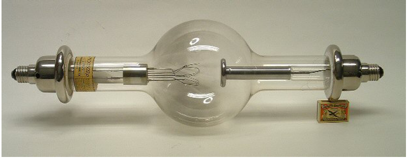
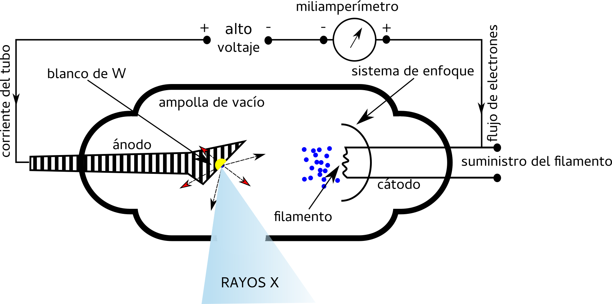
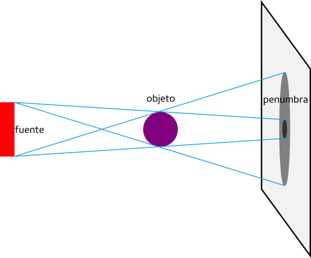
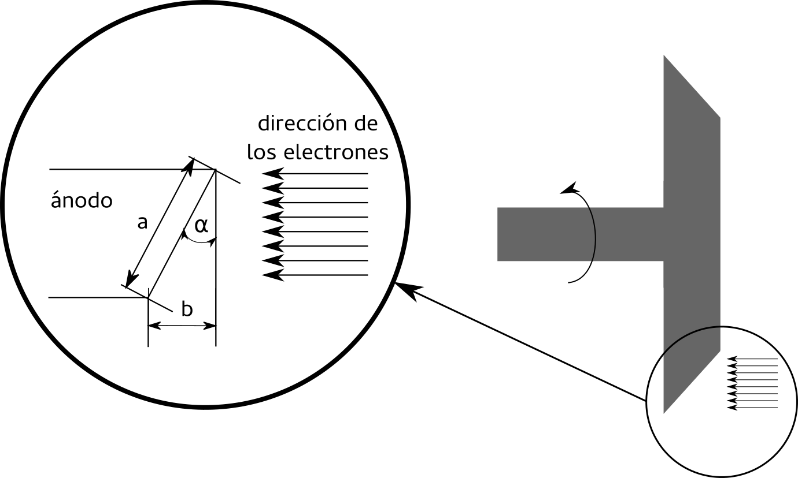

#################
Tubos de rayos x
#################

Se conoce como “tubo de rayos X” al lugar físico donde se genera esta radiación electromagnética mediante un proceso en el cual electrones acelerados son frenados al colisionar contra un blanco.

    **Figura 1 a:** Tubo de rayos x clásico.

Mientras que puede ser dibujado esquemáticamente como:

    **Figura 1 b:** Esquema de un tubo de rayos x clásico de Tungsteno.

El ánodo, también conocido como blanco o anticátodo, se encuentra gen- eralmente formado por una pieza de cobre con un blanco de tungsteno1. El cátodo, compuesto por un filamento metálico, al ser calentado lo suficiente, emite una “nube” de electrones en su superficie. Para generar esta nube, es necesario que el filamento alcance temperaturas muy elevadas, por lo que, aprovechando su alta temperatura de fusión, el filamento suele también ser de tungsteno.

Al aplicarse una diferencia de potencial ∆V (o simplemente V) entre el ánodo y el cátodo dejando al ánodo como positivo (+), los electrones que han sido desprendidos del cátodo por el calentamiento se dirigen al ánodo acelerándose por el campo eléctrico, alcanzando su velocidad máxima, al cuando llegan al ánodo. La energía cinética máxima que alcanzan, al ser electrones, expresada en electronvoltios (eV) es numéricamente igual a la diferencia de potencial V.

Al frenar bruscamente contra el blanco de W y perder toda su energía cinética, los electrones producen rayos X por frenado cuando interaccionan con el mismo. La energía de estos rayos X generados presenta un espectro cuyo valor máximo coincide con la energía máxima de los electrones y la diferencia de potencial entre el ánodo y el cátodo.

El rendimiento de producción en este procedimiento clásico en los tubos convencionales es bajo, ya que la mayor parte de la energía cinética de los electrones se transforma en calor al colisionar con el blanco. Así, en primera aproximación, el rendimiento es 10−6T·Z, donde T representa la energía cinética de los electrones escrita en unidades de keV (es decir la diferencia de potencial V expresada en kV) y el número atómico Z del blanco. Si, por ejemplo, se trata de un blanco de W (Z = 74) y se aplica una diferencia de potencial de 100kV, el rendimiento será de 10−6·100·74 = 7,4 · 10−3 ≈ 0,01. En este caso típico entonces, el rendimiento se encuentra entonces en el orden del 1 %, dejando que el otro 99 % se disipe en forma de calor sobre el ánodo. Por esto también es que se necesita un blanco compuesto por un material de alto punto de fusión y con gran capacidad para eliminar el calor. Por esto es que se utiliza el W en el extremo de una pieza de cobre refrigerada por circulación de aceite, agua o aire.

En los equipos de rayos X, el calentamiento del cátodo se produce por la circulación de la corriente eléctrica en el filamento, donde se verifica que una pequeña variación en la temperatura del filamento provoca una gran variación en el número de electrones que atravesarán el tubo. La diferencia de potencial en cambio, determinará la energía cinética máxima (y la veloci- dad) de los electrones, pero no influirá significativamente en el número de electrones que alcanzarán el ánodo.

Tubos de rayos x para diagnóstico
=================================

El objetivo de estos tubos es obtener rayos X capaces de atravesar material biológico en dimensiones del orden del cuerpo humano que se desea analizar. Para esto no solo es necesario obtener un haz de rayos X con la energía suficiente como para atravezar algunas decenas de centímetros de material biológico, sino también uno lo suficientemente homogéneo y de una superficie pequeña de forma tal de evitar problemas de penumbra.

Finalmente, también hay que lograr un haz con suficiente intensidad como para lograr una imágen nítica con un tiempo mínimo de exposición, no solo por la exposición a la misma, sino también por los movimientos propios del cuerpo humano (respiración, latido del corazón, etc).

Uno de los problemas típicos que se desea evitar y/o minimizar a la hora de la obtención de imágenes por rayos X, es el efecto de penumbra que puede dañar severamente la nitidez de la imagen. Se requieren entonces, para satisfacer esta necesidad, tres condiciones:

* que los rayos x provengan de una fuente “pequeña”
* que la distancia fuente-objeto sea “grande”
* que la distancia objeto-detector sea “pequeña”

En cada uno de los casos, “pequeña” o “grande” se refieren a tamaños relacionados con la geometría general. La Figura 2 muestra cualitativamente la formación de la penumbra.

    **Figura 2:** Efecto de penumbra.

Como se puede observar, la penumbra constituye un efecto geométrico.

Ánodo
*****

Se busca así, construir un ánodo capaz de:

* brindar una fuente pequeña
* proveer suficiente intensidad como para obtener una imagen nítida
* lidiar con el problema del calentamiento debido a los electrones prove- nientes del cátodo

Por esto, se dispone de un ánodo inclinado donde impactan los electrones, como se puede observar en lado izquierdo de la Figura 3. Aquí se define un ángulo α que hace que electrones que impactan sobre una longitud a se vean como si proveniesen de una fuente de longitud b desde el objeto/detector.

    **Figure 3:** Configuración del ánodo.

Así, por ejemplo, si contamos con un ángulo α = 17°y disponemos un ánodo donde a = 7 mm, entonces b será ≈ 2 mm. Si el ancho del ánodo entonces es de 2 mm, obtendremos una fuente de 14 mm pero que será “vista” por el detector como si fuese de 4 mm.

Por otro lado, para controlar finalmente, de forma parcial el problema
del calentamiento del ánodo, se lo diseña de forma tal que pueda girar, logrando que los electrones impacten siempre sobre una superficie diferente y disipando mejor el calor. El ánodo suele girar entre 10 y 12 mil rpm y se construye como se muestra en el lado derecho de la Figura 3. Además, en estos tubos α suele variar entre 16°y 17,5°.

Tubos de rayos X para radioterapia
==================================

Para el caso de radioterpia no es necesaria tanto la intensidad como la en- ergía entregada. En estos casos se vuelve crítico el control de la temperatura del ánodo al necesitarse irradiaciones por tiempos prolongados. Para esto se sumerge el tubo en aceite y para eliminar el calor transmitido a este se agrega un serpentín de agua fría circulando.

Al no ser tan importante la disminución del efecto de penumbra, el área de impacto de los electrones en el ánodo (fuente) puede ser mayor que en el caso de los tubos dedicados a estudios de diagnóstico.

Al ser utilizados electrones más energéticos para los tratamientos de radioterapia, a partir de los 200 keV el ánodo puede generar electrones eyectados por la misma interacción del blanco con aquellos que fueron acelerados desde el cátodo. Estos electrones eyectados interactuarán entonces con otras partes del tubo y generarán también rayos x que modificarán el haz principal.

Para evitar este último problema se suele cubrir la zona del ánodo primero con Cu y finalmente con W, como muestra la Figura 4. Así, al colisionar los nuevos electrones con el Cu (Z = 29) serán detenidos produciendo pocos rayos x, y éstos serán absorbidos por el W sin generar más radiación. Además se suele agregar una ventana de Be a la salida del haz, que amortigua el haz de rayos x y absorbe los electrones que hayan pasado el blindaje.

.. figure: img/tubo_cBlindaje.png
      :align: center

      **Figure 4:** Tubo para radioterapia.

En estos tubos, el ángulo α varía entre los 26°y los 32°, aumentando el cono útil.
